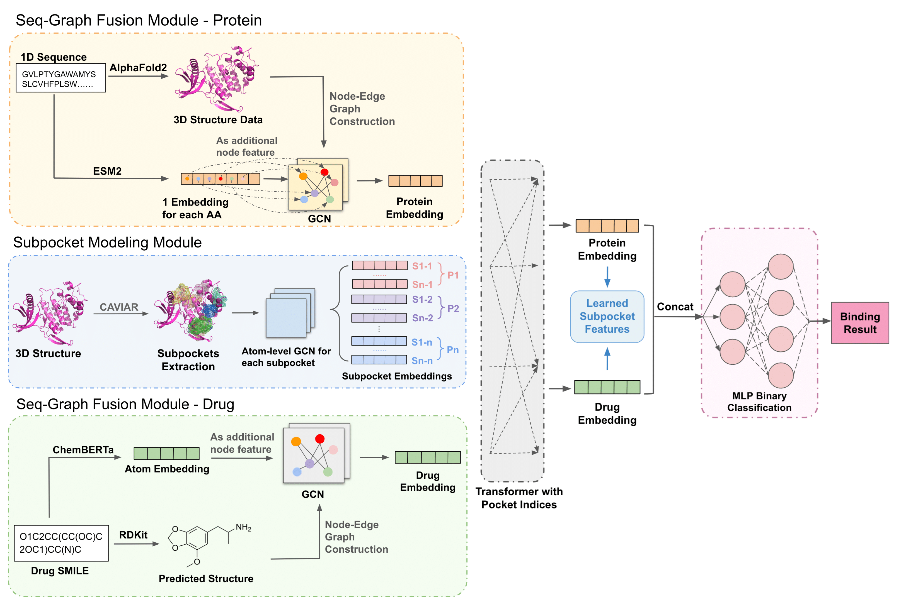

# SP-DTI: Subpocket-Informed Transformer for Drug-Target Interaction Prediction

## Overview

<p align="center">
  
</p>

SP-DTI is a Subpocket-Informed Transformer model for predicting drug-target interactions (DTI). It employs a Subpocket Modeling Module (SMM) for granular modeling of protein binding sites and a seq-Graph Fusion Module (SGFM) to integrate graph- and sequence-level information. Benchmark evaluations demonstrate that SP-DTI outperforms state-of-the-art models and remains robust in unseen protein and cross-domain settings.

## Installation
SP-DTI is based on our previous project, [FlexMol]((https://github.com/Steven51516/FlexMol/)). We modified FlexMol by removing unused components to make SP-DTI lightweight and added new modules, including unique encoders and interaction layers specific to SP-DTI.
 
1. **Clone the Repository**

   ```bash
   git clone https://github.com/Steven51516/SP-DTI.git
   cd spdti
   ```

2. **Create a New Conda Environment**

   ```bash
    conda create --name spdti python=3.8
    conda activate spdti
   ```
2. **Install Dependencies**
   ```bash
   pip install -r requirements.txt
   ```

## Dataset Preparation

### Step 1: Download the Dataset
Please download the dataset from the [MolTrans repository](https://academic.oup.com/bioinformatics/article/37/6/830/5929692) for the data splits of DAVIS and BIOSNAP.

### Step 2: Generate 3D Protein Structures
We use AlphaFold to convert protein sequences into 3D structures. You can download our precomputed AlphaFold results here: [Google Drive Link](#).

### Step 3: Identify Subpockets
Our method utilizes the CAVIAR algorithm to identify subpockets from the AlphaFold-generated structures. For sample scripts to run CAVIAR, please refer to our [Google Colab](#). Alternatively, you can download our processed dataset here: [Google Drive Link](#).

### Dataset Organization
We recommend structuring the dataset in the following format:

```plaintext
data/
│
├── DATASET_NAME/
│   ├── train.txt
│   ├── val.txt
│   ├── test.txt
│   ├── pdb/
│   ├── subpockets/
```
Replace DATASET_NAME with the name of the dataset you are working on (e.g., DAVIS, BIOSNAP) and ensure that the subfolders contain the respective files for each step.

## Run
Our script automatically manages everything from preprocessing to evaluation. If you want to analyze the result in custom way(eg. using you rown matrics), you can replace the last line "trainer.test" with "trainer.inferece", which returns two lists the prediced label and ground truth label.

You can directly run the following command to start the experiments:

```bash
python run.py --task {davis/biosnap} --train_split <path_to_train_split> \
--val_split <path_to_val_split> --test_split <path_to_test_split> \
--pdb_dir <path_to_pdb_files> --subpocket_dir <path_to_subpockets> \
--metrics_dir <path_to_metrics_output>
```

### Explanation of Parameters
--task {davis/biosnap}: Specifies the dataset you are working on. Replace {davis/biosnap} with either davis or biosnap depending on your experiment.

--train_split <path_to_train_split>: Path to the training dataset split.

--val_split <path_to_val_split>: Path to the validation dataset split.

--test_split <path_to_test_split>: Path to the testing dataset split.

--pdb_dir <path_to_pdb_files>: Path to the directory containing the 3D protein structure files in PDB format. 

--subpocket_dir <path_to_subpockets>: Path to the directory containing identified subpockets. These should be generated using the CAVIAR algorithm or downloaded as per Step 3 of Dataset Preparation.

--metrics_dir <path_to_metrics_output>: Path to the directory where the evaluation metrics and results will be saved after the experiment runs.

For instance, if you are running an experiment with the DAVIS dataset and have all the required files prepared, the command might look like this:

```bash
python run.py --task davis --train_split data/davis/train/ \
--val_split data/davis/val/ --test_split data/davis/test/ \
--pdb_dir data/davis/pdb/ --subpocket_dir data/davis/subpockets/ \
--metrics_dir results/davis/
```

## Pretrained Language Models
<!-- Our method leverages pretrained language models, including ESM for protein representations and ChemBERTa for drug representations. We extend our gratitude to the authors of Graphein and Transformers for providing tools that simplify the integration of these models through user-friendly interfaces. -->

Our scripts automatically handle the generation of embeddings from the pretrained models. However, we recommend storing these embeddings as pickle files, especially for models like ESM, which are computationally intensive. This approach prevents repetitive runs and saves time during subsequent analyses.

To enable pickle storage, simply add the parameter `pickle_dir = ...` in the relevant lines corresponding to the encoders in run.py. This will direct the generated embeddings to be saved in the specified directory for future use.

## Contact
Reach us at [sliu0727@usc.edu](mailto:sliu0727@usc.edu) or open a GitHub issue.

## License
SP-DTI is licensed under the BSD 3-Clause License.

This software includes components modified from the FlexMol project, which is licensed under the BSD 3-Clause License.